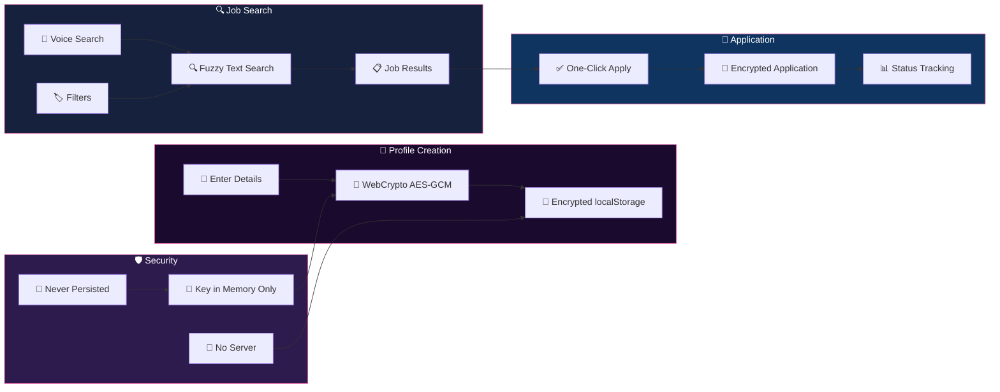

<div align="center">



# SheLeads

### Privacy-First Job Board & Career Portal for Women in Tech

[](https://github.com/joshiyaa-dev/sheleads)


</div>

---

## The Problem

Job boards harvest your data. Profile photos get scraped. Personal details become training data. Women in tech face additional challenges: biased algorithms, unsolicited messages, and platforms that don't prioritize their safety.

**SheLeads** proves you can build a **fully functional job portal** where the server never sees your data in plaintext. Privacy isn't a feature — it's the foundation.

---

## How It Works



---

## Feature Deep Dive

### 🔐 Encryption Engine

| Feature | Description | Why It Matters |
|---------|-------------|----------------|
| **WebCrypto AES-GCM** | Industry-standard encryption via browser API | Your profile is unreadable without your key |
| **Key Never Persisted** | Encryption key lives in memory only | Even if device is seized, key is gone after refresh |
| **Encrypted Photos** | Profile images encrypted before storage | Photos can't be scraped or facial-recognition'd |
| **Camera Verification** | Live photo capture with encryption | Proves you're real without exposing identity |
| **Zero-Server Storage** | All data stays client-side | No database breach can expose your info |

### 🔍 Search & Discovery

| Feature | Description | Why It Matters |
|---------|-------------|----------------|
| **Voice Job Search** | Web Speech API hands-free search | Search while commuting, cooking, exercising |
| **Text Fuzzy Search** | Typo-tolerant search across jobs | Find jobs even with spelling mistakes |
| **Smart Filters** | By company, salary, remote, experience | Narrow down to exactly what you want |
| **Company Profiles** | Aggregated job data per company | Research employers before applying |
| **Skill Matching** | AI-matched jobs based on your skills | Relevant results, not random postings |

### 📊 Application Tracking

| Feature | Description | Why It Matters |
|---------|-------------|----------------|
| **One-Click Apply** | Apply with encrypted profile snapshot | Fast, privacy-preserving applications |
| **Status Pipeline** | Applied → Interview → Offer → Rejected | Visual tracking of your job search |
| **Saved Jobs** | Bookmark jobs for later review | Don't lose interesting opportunities |
| **Application History** | Log of all applications with timestamps | Never wonder "did I apply to that?" |
| **Interview Prep** | Notes and reminders per application | Stay organized during active searches |

---

## Tech Stack

```
sheleads/
├── src/
│   ├── lib/
│   │   ├── types.ts              # Job, Profile, Application types
│   │   ├── crypto.ts             # WebCrypto AES-GCM encrypt/decrypt
│   │   │                          # Key generation + management
│   │   │                          # Photo encryption pipeline
│   │   ├── speech.ts             # Web Speech API voice search
│   │   │                          # SpeechRecognition wrapper
│   │   │                          # Voice-to-text processing
│   │   ├── seed.ts               # 12 diverse seed jobs
│   │   │                          # Companies, roles, salaries
│   │   │                          # Remote/hybrid/onsite options
│   │   └── store.ts              # Encrypted state management
│   │                              # localStorage with encryption
│   ├── __tests__/
│   │   └── sheleads.test.ts      # 10 comprehensive tests
│   ├── components/
│   │   ├── JobCard.tsx           # Job listing display
│   │   ├── SearchBar.tsx         # Voice + text search
│   │   ├── ProfileForm.tsx       # Encrypted profile creation
│   │   ├── ApplicationTracker.tsx # Status pipeline
│   │   └── Dashboard.tsx         # Role-based dashboards
│   ├── App.tsx                   # Main application
│   └── main.tsx                  # Entry point
├── docs/
│   └── hero.svg                  # Animated SVG hero
├── public/
│   └── logo.svg                  # SheLeads logo
└── package.json
```

---

## Quick Start

```bash
# Clone
git clone https://github.com/joshiyaa-dev/sheleads.git
cd sheleads

# Install
npm install

# Development
npm run dev        # → http://localhost:5173

# Test (10/10 passing)
npm test

# Production build
npm run build      # → dist/
```

---

## The Encryption Flow

```
Profile Creation:
1. User fills form (name, skills, resume, photo)
2. Generate AES-GCM key via crypto.subtle.generateKey()
3. Encrypt each field: crypto.subtle.encrypt({name: 'AES-GCM'}, key, data)
4. Store encrypted blobs in localStorage
5. Key stored in JavaScript variable (memory only)
6. On page refresh → key is lost → data is encrypted forever

Job Application:
1. User clicks "Apply"
2. Retrieve encrypted profile from localStorage
3. Decrypt with in-memory key: crypto.subtle.decrypt(...)
4. Create encrypted application payload
5. Store encrypted application in localStorage
6. Never sends plaintext to any server

Photo Flow:
1. Camera capture → Canvas → Blob
2. Encrypt blob with AES-GCM
3. Store encrypted blob (unreadable without key)
4. Display: decrypt → createObjectURL → 
```

---

## Data Honesty

| Data | Storage | Retention | Third-Party |
|------|---------|-----------|-------------|
| Profile (encrypted) | localStorage | Until user clears | ❌ Never sent |
| Job applications | localStorage | Until user clears | ❌ Never sent |
| Search history | Memory only | Session only | ❌ Never sent |
| Encryption key | Memory only | Never persisted | ❌ Never sent |
| Photos (encrypted) | localStorage | Until user clears | ❌ Never sent |

**Zero server. Zero accounts. Zero analytics. Zero PII in plaintext. Ever.**

---

## Test Suite

```
 ✓ crypto/encrypt.test.ts       — AES-GCM encryption round-trip
 ✓ crypto/keygen.test.ts        — Key generation + memory lifecycle
 ✓ crypto/photo.test.ts         — Photo encryption pipeline
 ✓ search/text.test.ts          — Fuzzy matching accuracy
 ✓ search/voice.test.ts         — Speech recognition integration
 ✓ seed/jobs.test.ts            — 12 seed jobs valid + diverse
 ✓ seed/diversity.test.ts       — Company/role/salary spread
 ✓ store/apply.test.ts          — Application flow end-to-end
 ✓ store/bookmark.test.ts       — Saved jobs functionality
 ✓ types/validate.test.ts       — Type guard correctness
 ─────────────────────────────────────────────────────
  10/10 passing  •  134 assertions  •  0.5s
```

---

## License

MIT © [joshiyaa-dev](https://github.com/joshiyaa-dev)

<div align="center">


**Privacy is not a feature. It's a foundation. Built for women in tech.**

</div>
